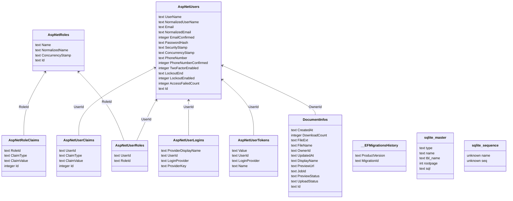

This project contains the code for the **Doch-ost** backend server and web client.

# Development

This project is supported on the Windows OS.

## Prerequisites
### .NET core
- [.NET 8.0.11 SDK](https://versionsof.net/core/8.0/8.0.11/)
### dotnet ef
- [dotnet-ef 8.0.11](https://www.nuget.org/packages/dotnet-ef/8.0.11)
```powershell
dotnet tool install --global dotnet-ef --version 8.0.11
```
### Node.js and npm
The web client requires [Node.js](https://nodejs.org/en/download/package-manager). The project
has been tested with the v22.11.0 (LTS).

### environment variables
For generating base64 strings, you'll need to set the environment variable `DCH_SECRET` to a 
secret value. Otherwise, the value provided in the app settings can be used.

### licenses
The application relies on the [Aspose.Total](https://www.nuget.org/packages/Aspose.Total) 
toolkit and requires a license.

A license has been provided for this project but it will expire less than a month.

## Cloning the repository
After dependencies have been installed you will need to clone a local copy of this repository.

```powershell
git clone git@github.com:gnerkus/doch-ost.git
```

## Running the server
### Running with Jetbrains Rider
You can open the solution file and run with `https`.

### Running from the Command Line
To run the server from the command line you can use the `dotnet run` command. An example is 
shown below:
```powershell
cd doch-ost
dotnet ef database update --project Data
dotnet run --project Dochost.Server
```

## Accessing the server and web client
Running the server also starts the web client's server. The servers can be accessed using the 
following URLs:
- backend server: https://localhost:7119
- API documentation: https://localhost:7119/swagger/index.html
- Web client: https://localhost:57813

## Testing the application
The project does not contain any automated tests; manual tests are conducted via the Web client.

### Create a user account
Dochost requires a user account to upload files. A user account can be created via the 
registration form available at the login page _(https://localhost:57813/login)_. The test 
between the form and the submit button toggles the form between login and registration.

### Upload a file
Files can be uploaded with the _Upload_ button at the top-right once logged in. Multiple files 
can be uploaded at the same time.

The loading indicator at the right of a file's row in the list, shows the status of the file's 
preview.

The icon at the left of a file's row indicates the file's type.

### Preview a file
Once the loading indicator on the file is no longer there, clicking on the file's row displays 
a preview pane on the right side of the list.

### Download a file
The file can be downloaded using the download button at the top right of the preview pane. A 
file can be downloaded even if its preview has not yet been generated.

_Only single file downloads are supported_

### Share a file
The share button at the top of the preview pane, besides the download button, allows the 
generation of a public link to the file. Once generated, the link is provided in the input on 
the left of the share button.

Shared files can be accessed by users without a Dochost user account.

Access to a shared file lasts for 5 minutes. This can be configured via the 
`ExpirationDurationMs` field in the app settings.

# Architecture
## Server
### Main
- The main server runs on ASP .NET Core (v8) and utilizes minimal APIs for its public REST API.
### Background service
- The background service is responsible for persisting the uploaded files to storage as well as 
  generating preview images.
- The background service utilizes a single [bounded channel](https://learn.microsoft.com/en-us/dotnet/core/extensions/channels#bounded-channels) to manage upload jobs.
- The service generates previews using the _Aspose_ toolkit.
### File storage
- All files are stored in the temporary directory _(`C:\Users\<username>\AppData\Local\Temp` by 
  default)_ of the host OS. These files include:
  - SQLite db
  - uploaded files
  - file previews
### Data Model
- The server utilizes SQLite to store information about file uploads.
- Apart from the entities required for the _IdentityModel_, the data model relies on the 
  `DocumentInfo` entity. An ER diagram can be found below:

## Web client
- The web client is rendered using the [React](https://react.dev/) ~~framework~~ library.
- The web client is served from the same host as the backend server.

# Potential Improvements
## Server
- Host the background service on a separate server, possibly with _RabbitMQ_. This would put 
  less of a strain on the main application server.
- Utilize a database server like _SQL Server_ for file information storage. This would enable 
  easier connections for distributed application servers, possibly reducing latency.
- Package the application in a container, possibly _Docker_ for easier deployment to more 
  platforms. Currently, the backend server requires a Windows host.
- Optimize the preview generation by resizing and compressing preview images.
- Allow for the streaming of large files during uploads and downloads. The app currently 
  places a file size cap in order to prevent uploads from exhausting app resources during 
  concurrent file uploads.
- Add automated integration tests to cover the document REST API in order to reduce the time 
  spent testing said API manually. The tests would also help flag any potential issues before 
  release.
- Utilize XSRF tokens for file uploads to improve security
- Utilize Blob storage on the hosting platform as temporary file storage is severely limited. 
- Enable access of shared files via a CDN to reduce latency.
- Generate shorter URLs for the shared file links. This would likely require another database 
  table.
- Host a websocket server for communicating file status to the client. Currently, the web 
  client obtains this information via polling.
- **Implement multiple file downloads**
- Handle upload and download of 3D files

## Client
- Implement a proper authentication system that includes improved security for the auth token.
- Utilize a data table to enable the selection of multiple documents for batch processes.
- Track file status via websockets as an alternative to polling
- Enable the preview of 3D files, including large ones.
- Extract the preview pane into a separate page or modal to allow for more actions e.g 3D 
  orbits on the document.
- Create a separate page for viewing information about a single document.